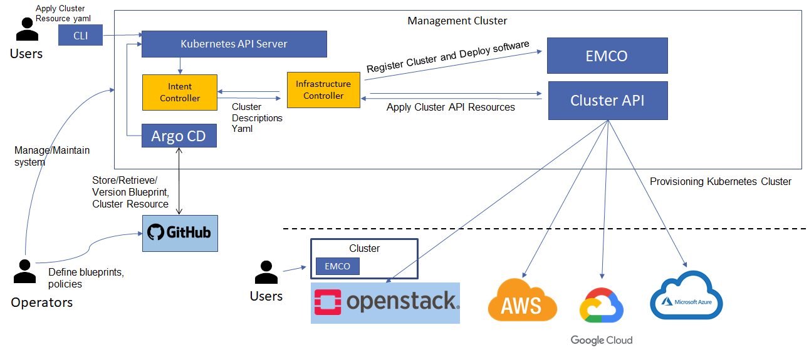
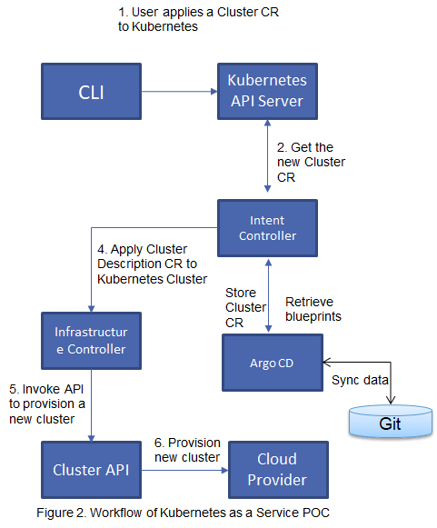
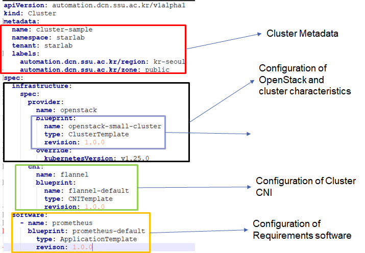
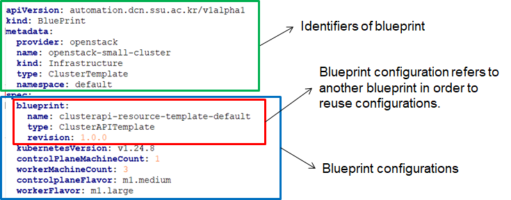
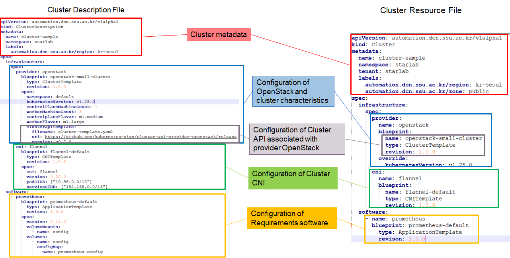

# Design of Kubernetes as a Service
Automation provisioning and managing Kubernetes cluster in cloud native way.
<!-- ## Motivation -->

## Architecture: Kubernetes as a Service Framework

## Controllers

### Intent Controller: 
Primarily Functions: 
- Managing blueprint resources, cluster resources
- Transforming (Intent) Cluster Resources with Blueprints to Cluster Descriptions Resources. 
- Make sure Cluster Descriptions Resources match states with Cluster Resources (re-transform Cluster Resources if it is changed).
- Versioning and Syncing Cluster Resources, Blueprint resources to GitHub repositories.
### Infrastructure Controller:
Primary Functions:
- Monitoring status of physical cluster through the Cluster API and OpenStack
- Reconciling Cluster Descriptions Resource to match states with physical cluster
- Managing kubeconfig, installing requirement software into physical clusters, and supporting automation features.

## Workflow

## Custom Resources Definition (CRDs)

A Custom Resource Definition or CRD is a Kubernetes extension mechanism for adding custom data types to Kubernetes. The CRDs are the schemas - analogous to table definitions in a relational database for example. The instances of those - analogous to rows in a RDBMS - are called Custom Resources or CRs. People often accidentally say "CRDs" when they mean "CRs", so be sure to ask for clarification if the context doesn't make it clear which is meant.

In Kubernetes, resources - built-in ones as well as CRs - are processed by controllers. A controller actuates the resource. For example, K8s actuates a Service with Type LoadBalancer by creating a cloud provider load balancer instance. Since Kubernetes is declarative, it doesn't just actuate once. Instead, it actively reconciles the intent declared in the resource, with the actual state of the managed entity. If the state of the entity changes (a Pod is destroyed), Kubernetes will modify or recreate the entity to match the desired state. And of course if the intended state changes, Kubernetes will actuate the new intention. Speaking precisely, a controller manages one or a few very closely related types of resources. A controller manager is single binary that embeds multiple controllers, and an operator is a set of these that manages a particular type of workload. Speaking loosely, controller and operator are often used interchangeably, though an operator always refers to code managing CRs rather than Kuberenetes built-in types.

All Kubernetes resources have a metadata field that contains the name, namespace (if not cluster scoped), annotations and labels for the resource. Most resources also have a spec and a status field. The spec field holds the intended state, and the status field holds the observed state and any control data needed by the controller to do its job. Typically, controllers read the spec and write the status.

Kubernets Custom Resources: https://kubernetes.io/docs/concepts/extend-kubernetes/api-extension/custom-resources/
### Kubernetes Resource Model
Simple core principles:

- Makes configuration data in versioned storage (git) the source of truth
Uses a uniform, serializable data model (KRM) to represent configuration
- Separates code that acts on the configuration from the data
- Clients manipulating configuration data don’t need to directly interact with  storage, they operate on data via APIs

More information: https://github.com/kubernetes/design-proposals-archive/blob/main/architecture/resource-management.md
### Our Custom Resource Definition
There are 3 kinds of Custom Resources:
- **Cluster Resources**: High-level (Intent) Resource defines Kubernetes cluster.
- **Cluster Descriptions Resources**: Kubernetes resources describe all configurations, parameters, and policies that use to manage, create, update, and reconcile the running Kubernetes cluster in the provider cloud.
- **Blueprint Resources**: Pre-defined configurations use for configuring, intent procedure creating Cluster Description Resources from high-level resources.

> Cluster Resources and Blueprint Resources are consumed by Intent Controller. Meanwhile, Cluster Descriptions Resources are consumed by Infrastructure Controller.
#### Cluster Resource: 
Cluster Resources: Only contains some high-level configuration (blueprints). Example: 
- Location, Placement, 
- Kind of infrastructure where the cluster will reside Provider configurations related
    - Cluster API configurations
    - OpenStack configurations
    - …
- Kubernetes configurations (K8s version, master node count, worker node count,..)
- CNI will deploy into the cluster(Flannel version 0.40.0, Cillium version 1.12.5,..) .
- Requirements pre-installed software (Prometheus version 2.41.0,..)

> Cluster Resources are stored in both the Kubernetes cluster and Github cluster repository.

#### Blueprint:
Blueprint Resources: referred to pre-defined configurations that contains configurations about Cloud provider, metadata, cluster settings,…
- Blueprints are created by administrators/operators
- Blueprints are stored in both the Kubernetes cluster and Github blueprints repository.

#### Cluster Description Resource:
Cluster Description Resources: contain all complex parameters, characteristics, and policies,.. that define the physical cluster reside in provider cloud.

Cluster Description Resources are output of Intent Controller from procedure to translate and combine Cluster Resources with Blueprint

Cluster Description Resource is consumed and reconciled by the Infrastructure controller.

